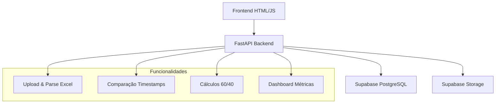

# 🚗 MultiPark Dashboard

**Dashboard para gestão e análise de bookings com divisão financeira automática 60/40**

[](https://fastapi.tiangolo.com)
[](https://postgresql.org)
[](https://supabase.com)
[](https://opensource.org/licenses/MIT)

---

## 📋 **Funcionalidades**

✅ **Upload Excel** - Carregamento e processamento automático  
✅ **Comparação Datas** - Detecta discrepâncias entre timestamps  
✅ **Aprovação Manual** - Sistema de OK para diferenças ≥1 dia  
✅ **Divisão 60/40** - Cálculos automáticos Parceiro/Multipark  
✅ **Dashboard Stats** - Métricas em tempo real  
✅ **Export Excel** - Relatórios financeiros por categoria  

---

## 🏗️ **Arquitetura**



### **Stack Tecnológica**
- **Backend**: FastAPI + SQLModel + PostgreSQL
- **Frontend**: HTML5 + CSS3 + Vanilla JavaScript  
- **Base de Dados**: Supabase (PostgreSQL + Storage)
- **Deploy**: Docker + GitHub Actions

---

## 🚀 **Quick Start**

### **1. Clonar Repositório**
```bash
git clone https://github.com/JorgeTabuada/multipark-dashboard.git
cd multipark-dashboard
```

### **2. Configurar Ambiente**
```bash
# Copiar variáveis ambiente
cp .env.example .env

# Editar variáveis Supabase
nano .env
```

### **3. Executar com Docker**
```bash
# Build e executar
docker-compose up --build

# Aceder aplicação
open http://localhost:3000
```

---

## 📊 **Como Usar**

### **1. Upload de Ficheiro Excel**
1. Ir para aba "Upload Excel"
2. Arrastar ficheiro `.xlsx/.xls` ou clicar para seleccionar
3. Sistema processa automaticamente todos os campos obrigatórios

### **2. Verificar Discrepâncias**
1. Aba "Bookings" mostra tabela com cores:
   - 🟢 **Verde**: Datas coincidem
   - 🟡 **Amarelo**: Diferença 1 dia (auto-aprovado)  
   - 🔴 **Vermelho**: Diferença ≥1 dia (requer aprovação)

### **3. Aprovar Manualmente**
- Clicar botão **"OK"** em cada linha vermelha
- Ou usar **"Aprovar Todos"** para aprovação em lote

### **4. Consultar Divisão Financeira**
- **Aba Parceiro (60%)**: Valores destinados ao parceiro
- **Aba Multipark (40%)**: Valores da empresa
- Breakdown por marca de parque e método pagamento

---

## 🔧 **Lógica de Negócio**

### **Comparação de Datas**
- **Regra**: Diferença ≥1 dia a partir das 01:00 do dia seguinte
- **Auto-aprovação**: Diferenças <1 dia ou exactamente 1 dia dentro limite
- **Aprovação manual**: Diferenças ≥1 dia após 01:00

### **Divisão Financeira**
```python
# Cálculo automático sobre priceOnDelivery
partner_60 = priceOnDelivery * 0.60
multipark_40 = priceOnDelivery * 0.40
```

### **Estados dos Bookings**
1. **Pendente** - Aguarda aprovação (linha vermelha)
2. **Auto-aprovado** - Diferença dentro limite (linha verde/amarela)  
3. **Aprovado Manualmente** - Utilizador clicou "OK"

---

## 📞 **Suporte**

- **Issues**: [GitHub Issues](https://github.com/JorgeTabuada/multipark-dashboard/issues)
- **Email**: suporte@multipark.pt

---

## 📄 **Licença**

Este projeto está licenciado sob MIT License.

---

**Desenvolvido com ❤️ para MultiPark**
